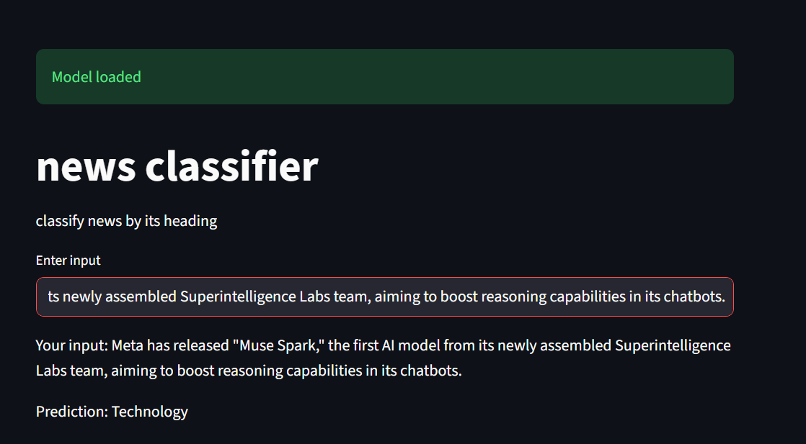
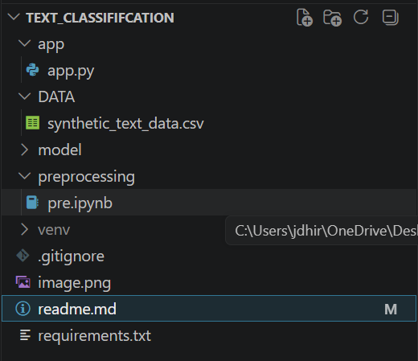

### NEWS HEADING CLASSIFIER USING MACHINE LEARNING

It is machine learning based news heading based classifier that use to classify the news based on the heading, without analysing entire news. its feed the news headline and categories based on the thier categories. **achived 88% test accuracy**

##### FEATURE OF PROJECTS 
1) Text processing porformed
2) Countvectorizer to convert the text to the vector to feed Machine Learning Algorithm
3) Train MultinomialNB , Logistic Regression and LinearSVC
   
##### PROJECT STRUCTURE 

##### INSTALLATION

--> follow this rule to run this project locally

1) git colne https://github.com/jrDhiraj/news_classifier.git
2) cd TEXT_CLASSIFICATION
3) pip install requirments.txt
   
#### USES

How to use this projects 
|    cd text_classication 
|    stramlit run app/app.py

#### MODEL TRAINING 
* Text data preprocessd 
* Converted in vector using tfidfvectorizer
* Trained base model **logistic regression 82% ** accuracy achived 
* compare with some other model like **svm got 82% ** accuracy 
* Train naive bayes model **MultinomialNB** got 88% accuracy 
* becouse the output label class is balanced so we can trust on the Accuracy 

#### RESULT 
Using **MultinomialNB** model with  (*88%*) accuracy 

###### Author - Dhiraj Sharma

